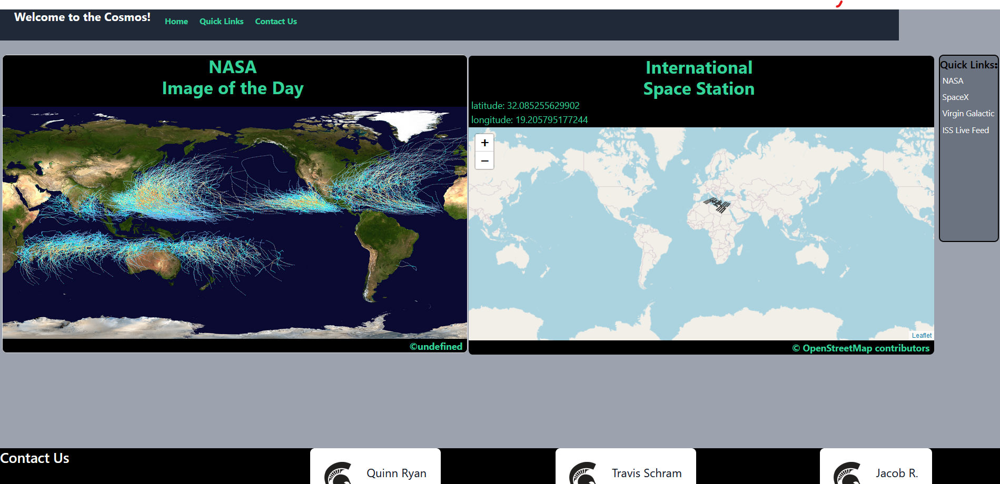

# Space In Your Face

We have designed a space themed web page with a couple of very interesting APIs. The first uses the two-line element (TLE) set to calculate the current location of the ISS in Earth's orbit. The second is a picture of the day from NASA. Quick links to several space related websites are included at the right side of the page so users can more easily access their site.

## APIs used

The [Where the ISS at API](https://wheretheiss.at/) uses the [two line element set](https://en.wikipedia.org/wiki/Two-line_element_set) of the International Space Station to display where it is. The TLE data is then converted into latitude and longitude in JSON format. This location is of course approximate due to there being no solid point of reference in space and the incredible speed of the Space Station. This information is then used by tiles to build the map for [Openstreetmap](https://www.openstreetmap.org/) to display. The ISS image is displayed using [Leaflet](https://leafletjs.com/) according to the TLE data.

***

[APOD](https://apod.nasa.gov/apod/astropix.html) is NASA's picture of the day API which is used to display a new picture every day from their photo library. Photos from the [Curiosity rover](https://apod.nasa.gov/apod/ap210914.html), [nebulas](https://apod.nasa.gov/apod/ap210818.html), and some particularly beautiful [astronomical phenomenon](https://apod.nasa.gov/apod/ap210901.html) are some of the many things they have included. The website can also be visited to see the full library of pictures, of which there are thousands.

## The Page Itself

In the Quick Links section, we have included a link to a few space related websites. From top to bottom we have [NASA](https://www.nasa.gov/), [SpaceX](https://www.spacex.com/), [Virgin Galactic](http://www.virgingalactic.com/), and of course the [ISS live stream](https://www.nasa.gov/multimedia/nasatv/iss_ustream.html). The information on these websites can (and should) be explored as they are incredibly informative. 

## Additional Information

This project was made for the MSU coding boot camp unit 7 project 1. The website may be built upon to include more information and interaction in the future. Space In Your Face is deployed live to Github Pages for your browsing.

## Links

- [Space In Your Face Website](https://letqin.github.io/space-in-your-face/)

- [Our GitHub Repository](https://github.com/letqin/space-in-your-face)

- [Astronomy Picture Of the Day](https://apod.nasa.gov/apod/astropix.html)

- [Where the ISS at API](https://wheretheiss.at/)

- [NASA's open APIs](https://api.nasa.gov/)

- [Openstreetmap](https://www.openstreetmap.org/)

- [Leaflet](https://leafletjs.com/)